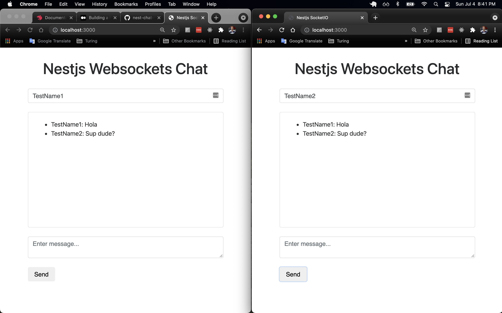

# Nest Chat using Websockets


## Description

A Nest Websockets Chat tutorial by Gabriel Tanner's [Medium Post](https://medium.com/better-programming/building-a-realtime-chat-in-nestjs-9c0b680be33f)  
The app provides a form to send messages from window to window locally

<br/>

<p align='center'>
  
</p>

<br/>

## Technologies

  - [Nest 7.6.0](https://github.com/nestjs/nest) framework TypeScript starter repository.
  - Vue
  - Bootstrap

## Installation

```bash
$ npm install
```

## Running the app

```bash
# development
$ npm run start

# watch mode
$ npm run start:dev

# production mode
$ npm run start:prod
```

## Test

```bash
# unit tests
$ npm run test

# e2e tests
$ npm run test:e2e

# test coverage
$ npm run test:cov
```
